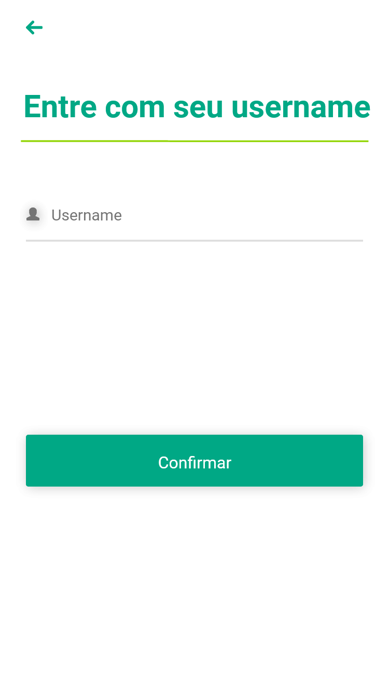
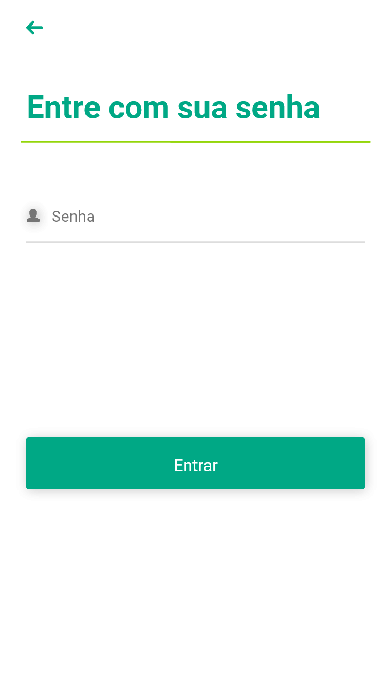
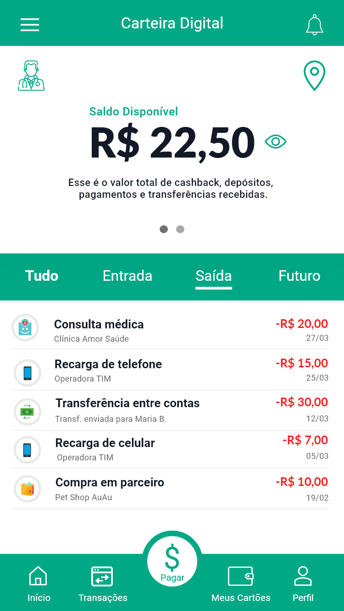
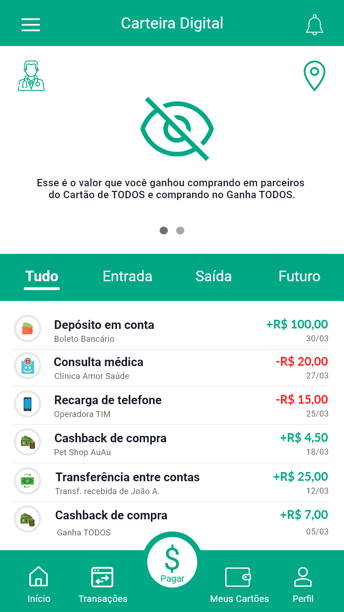

How-to-solve
------------
- O app deve ser feito em React-Native
- Use Git
- Procure fazer micro commits que são muitos commits com menos código isso nos ajuda a compreender a sua lógica
- Nos pergunte sobre qualquer dúvida que venha a surgir durante o desenvolvimento
- Documente detalhadamente quaisquer referencias/ferramentas que vc pesquisar
- Crie um repositório público e nos passe o link para acompanharmos o desenvolvimento


Problema
--------

A MAISTodos precisa mostrar para os seus clientes o saldo disponível em suas respectivas MAISContas

Para isso vamos fazer um APP mobile bem simples, que mostra apenas as movitações da conta do cliente e o seu saldo

Para isso vamos consultar a nossa API de CC

Para o login na aplicação, primeiro deve ter uma tela de input do username
O username deve ter uma validação de cpf (máscara)
E depois uma tela para a senha, e aí enviar para a API


Deve seguir os conceitos
========================
- Essas telas são sugestões, não são necessariamente obrigatórias
- Saldo carregado via api, mais não ficaria visível num primeiro momento
- Click para mostrar o saldo
- Fica a seu critério limpar o layout: tem vários link, botões, etc...que não serão usados neste exercício
- Importante ter as abas (Entrada e Saída)

Documentação da API
===================

API de Login
------------
- Não exite validação na api dos dados de login
- https://5efb30ac80d8170016f7613d.mockapi.io/api/mock/login
```json
{
  "username": "123",
  "password": "123"
}
```

```curl
curl --request POST \
  --url https://5efb30ac80d8170016f7613d.mockapi.io/api/mock/login --header 'Content-Type: application/json' --data '{
	"username": "a"
}'
```

API de saldo
------------
- saldo (float com o saldo)
- https://5efb30ac80d8170016f7613d.mockapi.io/api/mock/balance

```json
{
  "saldo": 12
}
```

```curl
curl --request GET \
  --url https://5efb30ac80d8170016f7613d.mockapi.io/api/mock/balance \
  --header 'Content-Type: application/json'
```

API de transações
-----------------

- tipoLancamento C para Crédito e D para Débito
- https://5efb30ac80d8170016f7613d.mockapi.io/api/mock/transactions


Resposta:
```json
[
    {
      "id": 1102,
      "descricao": "CREDENCIADO TESTE",
      "dataTransacao": "2020-01-28",
      "tipoTransacao": "Recarga Pré-pago ",
      "valorTransacao": 20,
      "tipoLancamento": "C",
      "cartaoMascarado": "600000******1234",
      "finalCartao": "1234",
      "nomePortador": "RITA DE CASSIA ALVES MACEDO "
    },
   ...
 ]
 ```
 
 ```curl
 curl --request GET \
  --url https://5efb30ac80d8170016f7613d.mockapi.io/api/mock/transactions \
  --header 'Content-Type: application/json'
 ```
 
 Boa Sorte!
 ----------


Sugestões de Layout
-------------------

Login
=====


Senha
=====


Saldo + Transações
==================



Saldo + Transações
==================

